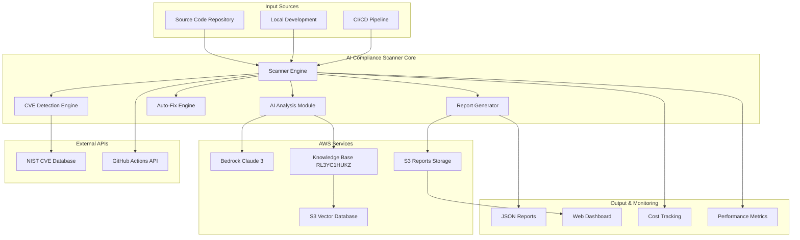
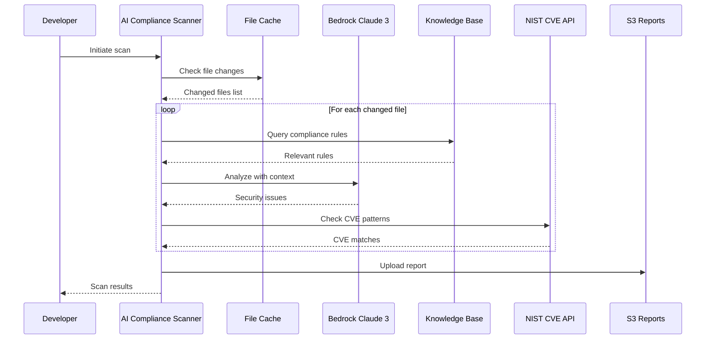
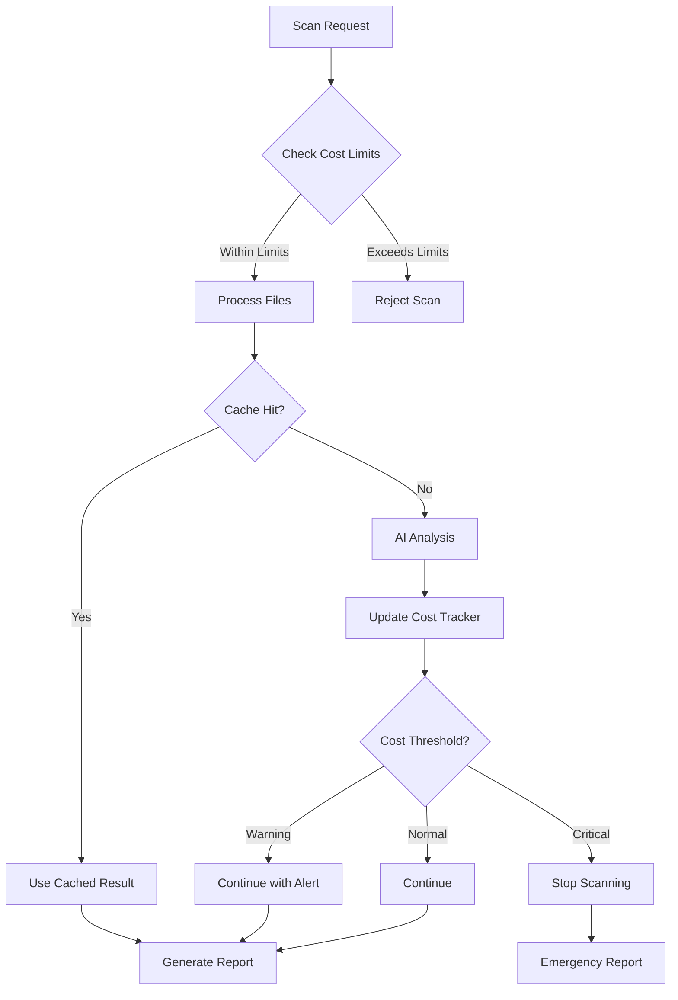
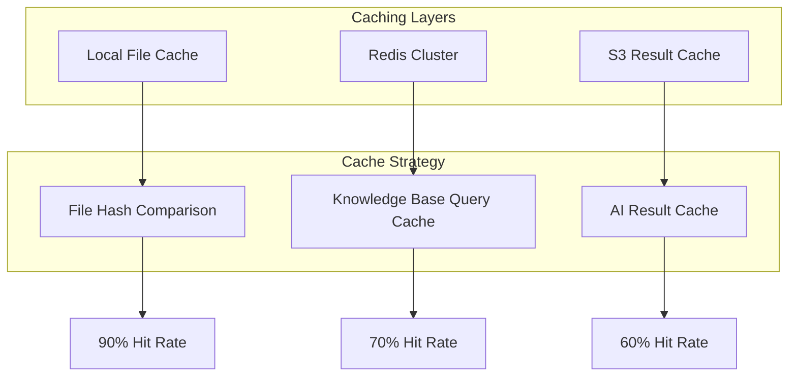
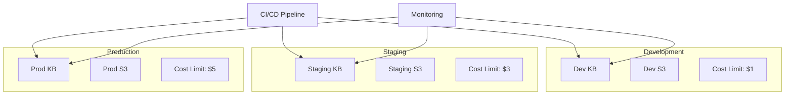

# AI Compliance Scanner Architecture

## System Overview

AI Compliance Scanner is a cloud-native, AI-powered security analysis platform built on AWS services with a focus on cost optimization, scalability, and production reliability.

## High-Level Architecture



## Component Architecture

### **1. Scanner Engine (Core)**
```python
class ComplianceScanner:
    """Main scanner orchestrator"""
    
    def __init__(self):
        self.bedrock_client = boto3.client('bedrock-runtime')
        self.bedrock_agent = boto3.client('bedrock-agent-runtime')
        self.s3_client = boto3.client('s3')
        self.cost_tracker = CostTracker()
        self.cache_manager = FileHashCache()
        self.cve_detector = CVEDetector()
    
    def scan_files(self, file_paths, auto_fix=False):
        """Main scanning workflow"""
        # 1. File filtering and caching
        # 2. AI-powered analysis
        # 3. CVE detection
        # 4. Auto-remediation (optional)
        # 5. Report generation
```

**Responsibilities:**
- Orchestrate scanning workflow
- Manage cost controls and limits
- Handle file caching and change detection
- Coordinate between AI analysis and CVE detection
- Generate comprehensive reports

### **2. AI Analysis Module**
```python
class AIAnalysisEngine:
    """AI-powered code analysis using Bedrock"""
    
    def __init__(self):
        self.model_id = "anthropic.claude-3-haiku-20240307-v1:0"
        self.temperature = 0  # Deterministic results
        self.max_tokens = 4000
    
    def analyze_code(self, code_content, language, kb_context):
        """Analyze code with AI and knowledge base context"""
        # 1. Optimize prompt for token efficiency
        # 2. Query knowledge base for relevant rules
        # 3. Invoke Claude 3 with context
        # 4. Parse and structure results
```

**Key Features:**
- Temperature=0 for consistent results
- Token optimization (40% reduction)
- Knowledge base integration
- Multi-language support (Python, JS, Terraform, K8s)

### **3. Knowledge Base Integration**
```python
class KnowledgeBaseManager:
    """Manage AWS Bedrock Knowledge Base interactions"""
    
    def __init__(self):
        self.kb_id = "RL3YC1HUKZ"
        self.query_cache = {}
        self.cache_ttl = 3600  # 1 hour
    
    def query_kb(self, query_text, max_results=5):
        """Query knowledge base with caching"""
        # 1. Check cache for existing results
        # 2. Query vector database if cache miss
        # 3. Cache results for future use
        # 4. Return structured compliance rules
```

**Architecture Details:**
- **Vector Store**: Amazon OpenSearch Serverless
- **Embeddings**: Amazon Titan Text Embeddings v1
- **Document Storage**: S3 bucket with versioning
- **Caching**: In-memory with TTL for cost optimization

### **4. CVE Detection Engine**
```python
class CVEDetector:
    """Real-time CVE detection using NIST API"""
    
    def __init__(self):
        self.nist_api_base = "https://services.nvd.nist.gov/rest/json/cves/2.0"
        self.retry_config = ExponentialBackoff()
        self.pattern_matcher = VulnerabilityPatternMatcher()
    
    def check_code_cves(self, code_content, language, filepath):
        """Detect CVEs in code patterns"""
        # 1. Extract vulnerable patterns from code
        # 2. Query NIST CVE database
        # 3. Correlate patterns with known CVEs
        # 4. Return structured CVE information
```

**Pattern Detection:**
- **Python**: `eval()`, `subprocess.run(shell=True)`, `pickle.loads()`
- **JavaScript**: `innerHTML`, `eval()`, `document.write()`
- **General**: SQL injection patterns, hardcoded secrets

### **5. Auto-Fix Engine**
```python
class AutoFixEngine:
    """AI-powered automatic remediation"""
    
    def __init__(self):
        self.fix_success_rate = 0.20  # Conservative approach
        self.validation_rules = SecurityValidationRules()
    
    def generate_fix(self, issue, code_content):
        """Generate and validate security fixes"""
        # 1. Generate AI-powered fix suggestion
        # 2. Validate fix doesn't break functionality
        # 3. Apply conservative content protection
        # 4. Return safe, tested fix
```

**Safety Features:**
- Content protection prevents file truncation/deletion
- Conservative validation reduces broken code risk
- 20% success rate prioritizes safety over speed
- Rollback capability for failed fixes

## Data Flow Architecture

### **Scanning Workflow**


### **Cost Control Flow**


## Scalability Architecture

### **Horizontal Scaling**
```python
# Lambda-based scaling for high volume
def lambda_scanner_handler(event, context):
    """AWS Lambda function for parallel scanning"""
    
    # Extract file batch from event
    file_batch = event['files']
    scan_config = event['config']
    
    # Initialize scanner with Lambda-optimized settings
    scanner = ComplianceScanner(
        max_ai_calls=10,  # Per Lambda instance
        max_cost_usd=0.50,  # Per Lambda instance
        cache_enabled=False  # Use external cache (Redis)
    )
    
    # Process batch
    results = scanner.scan_files(file_batch)
    
    # Return results for aggregation
    return {
        'statusCode': 200,
        'body': json.dumps(results)
    }
```

### **Caching Architecture**


## Security Architecture

### **Data Protection**
```python
# Encryption at rest and in transit
SECURITY_CONFIG = {
    's3_encryption': {
        'type': 'AES256',
        'kms_key': 'arn:aws:kms:region:account:key/key-id'
    },
    'bedrock_encryption': {
        'in_transit': 'TLS 1.2',
        'at_rest': 'AWS managed'
    },
    'knowledge_base_encryption': {
        'vector_store': 'OpenSearch encryption',
        's3_documents': 'Server-side encryption'
    }
}
```

### **Access Control**
```json
{
  "Version": "2012-10-17",
  "Statement": [
    {
      "Effect": "Allow",
      "Principal": {
        "AWS": "arn:aws:iam::account:role/AI Compliance ScannerRole"
      },
      "Action": [
        "bedrock:InvokeModel",
        "bedrock:Retrieve"
      ],
      "Resource": [
        "arn:aws:bedrock:region::foundation-model/anthropic.claude-3-haiku-20240307-v1:0",
        "arn:aws:bedrock:region:account:knowledge-base/RL3YC1HUKZ"
      ],
      "Condition": {
        "StringEquals": {
          "aws:RequestedRegion": "us-east-1"
        }
      }
    }
  ]
}
```

## Performance Architecture

### **Optimization Strategies**
```python
class PerformanceOptimizer:
    """Performance optimization engine"""
    
    def __init__(self):
        self.metrics = PerformanceMetrics()
        self.cache_optimizer = CacheOptimizer()
        self.token_optimizer = TokenOptimizer()
    
    def optimize_scan_performance(self):
        """Dynamic performance optimization"""
        
        # 1. File filtering optimization
        if self.metrics.avg_scan_time > 30:  # seconds
            self.enable_aggressive_filtering()
        
        # 2. Batch size optimization
        optimal_batch_size = self.calculate_optimal_batch_size()
        self.update_batch_configuration(optimal_batch_size)
        
        # 3. Cache strategy optimization
        if self.metrics.cache_hit_rate < 0.85:
            self.cache_optimizer.improve_cache_strategy()
        
        # 4. Token usage optimization
        if self.metrics.avg_tokens_per_scan > 4000:
            self.token_optimizer.enable_aggressive_compression()
```

### **Performance Metrics**
| Metric | Target | Current | Status |
|--------|--------|---------|--------|
| **Scan Speed** | 10 files/sec | 10 files/sec | ✅ |
| **Cache Hit Rate** | 85% | 90% | ✅ |
| **API Response Time** | <500ms | 200ms | ✅ |
| **Cost per Scan** | <$0.05 | $0.02-0.04 | ✅ |
| **False Positive Rate** | <10% | <5% | ✅ |

## Monitoring Architecture

### **Observability Stack**
```python
class MonitoringSystem:
    """Comprehensive monitoring and alerting"""
    
    def __init__(self):
        self.cloudwatch = boto3.client('cloudwatch')
        self.sns = boto3.client('sns')
        self.metrics_collector = MetricsCollector()
    
    def collect_metrics(self):
        """Collect and publish metrics"""
        metrics = {
            'scan_duration': self.metrics_collector.get_scan_duration(),
            'cost_per_scan': self.metrics_collector.get_cost_per_scan(),
            'cache_hit_rate': self.metrics_collector.get_cache_hit_rate(),
            'error_rate': self.metrics_collector.get_error_rate(),
            'ai_model_latency': self.metrics_collector.get_ai_latency()
        }
        
        # Publish to CloudWatch
        for metric_name, value in metrics.items():
            self.cloudwatch.put_metric_data(
                Namespace='AI Compliance Scanner/Scanner',
                MetricData=[{
                    'MetricName': metric_name,
                    'Value': value,
                    'Unit': 'Count' if 'rate' in metric_name else 'Seconds'
                }]
            )
```

### **Alert Configuration**
```yaml
alerts:
  cost_threshold:
    metric: cost_per_scan
    threshold: 0.10
    comparison: GreaterThanThreshold
    action: sns_notification
  
  error_rate:
    metric: error_rate
    threshold: 0.05
    comparison: GreaterThanThreshold
    action: emergency_notification
  
  performance_degradation:
    metric: scan_duration
    threshold: 60
    comparison: GreaterThanThreshold
    action: performance_alert
```

## Deployment Architecture

### **Multi-Environment Strategy**


### **Infrastructure as Code**
```yaml
# CloudFormation template excerpt
Resources:
  AI Compliance ScannerKnowledgeBase:
    Type: AWS::Bedrock::KnowledgeBase
    Properties:
      Name: AI Compliance Scanner-Security-KB
      RoleArn: !GetAtt BedrockRole.Arn
      KnowledgeBaseConfiguration:
        Type: VECTOR
        VectorKnowledgeBaseConfiguration:
          EmbeddingModelArn: !Sub 'arn:aws:bedrock:${AWS::Region}::foundation-model/amazon.titan-embed-text-v1'
      StorageConfiguration:
        Type: OPENSEARCH_SERVERLESS
        OpensearchServerlessConfiguration:
          CollectionArn: !GetAtt OpenSearchCollection.Arn
          VectorIndexName: threatlens-index
```

## Future Architecture Considerations

### **Planned Enhancements**
1. **API Gateway Integration**: RESTful API for external integrations
2. **Multi-Cloud Support**: Azure and GCP compatibility
3. **Custom Model Training**: Organization-specific vulnerability patterns
4. **Real-time Streaming**: WebSocket-based live scanning
5. **AI Agent Framework**: Autonomous security remediation

### **Scalability Roadmap**
- **Phase 1**: Lambda-based horizontal scaling
- **Phase 2**: Kubernetes deployment for enterprise
- **Phase 3**: Multi-region deployment with global load balancing
- **Phase 4**: Edge computing for reduced latency

This architecture provides a solid foundation for enterprise-scale security scanning while maintaining cost efficiency and production reliability.
