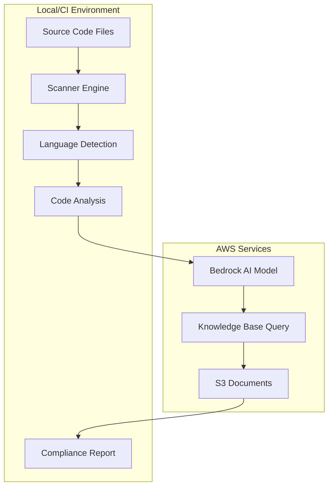

# 🏗️ Architecture Overview

## System Architecture

The AI-Powered Compliance Security Scanner follows a modular, cloud-native architecture designed for scalability, cost-efficiency, and maintainability.



## Core Components

### 1. Scanner Engine (`compliance_scanner.py`)
- **Purpose**: Main orchestration engine
- **Responsibilities**:
  - File discovery and language detection
  - AI model interaction
  - Knowledge Base integration
  - Report generation
  - Auto-fix functionality

### 2. Language Detection System
- **Supported Languages**: Python, JavaScript, Terraform, Kubernetes, Go, Java, C#
- **Framework Detection**: Django, React, Express, Spring Boot, .NET
- **File Pattern Matching**: Extension-based with content validation

### 3. AI Analysis Engine
- **Model**: Amazon Bedrock Claude 3 Haiku
- **Input**: Numbered code lines + compliance context
- **Output**: Structured security findings with line numbers
- **Cost**: ~$0.008 per analysis call

### 4. Knowledge Base Integration
- **Service**: Amazon Bedrock Knowledge Base
- **Storage**: S3 bucket with compliance documents
- **Query**: Real-time rule lookup based on code context
- **Traceability**: Direct links to source documents

### 5. Compliance Engine
- **Standards**: PCI-DSS, SOC2, HIPAA, GDPR, OWASP Top 10
- **Validation**: AI-powered rule matching
- **Severity**: Critical, High, Medium, Low classification
- **Remediation**: AI-generated fix suggestions

## Data Flow

### 1. Initialization Phase
```python
# Environment configuration
AWS_REGION = os.getenv('AWS_REGION', 'us-east-1')
BEDROCK_KB_ID = os.getenv('BEDROCK_KB_ID')
BEDROCK_MODEL_ID = os.getenv('BEDROCK_MODEL_ID')

# AWS service clients
bedrock = boto3.client('bedrock-runtime')
bedrock_agent = boto3.client('bedrock-agent-runtime')
```

### 2. File Discovery Phase
```python
# Multi-language file detection
SUPPORTED_EXTENSIONS = {
    '.py': 'Python',
    '.js': 'JavaScript', 
    '.tf': 'Terraform',
    '.yaml': 'Kubernetes',
    # ... more languages
}
```

### 3. Analysis Phase
```python
# AI-powered security analysis
def compliance_detect(code, language, framework, filepath):
    # 1. Query Knowledge Base for relevant rules
    kb_info = query_kb_for_rules(code, language)
    
    # 2. Prepare AI prompt with numbered code
    prompt = create_analysis_prompt(code, language, kb_info)
    
    # 3. Call Bedrock AI model
    response = bedrock.invoke_model(prompt)
    
    # 4. Parse and structure results
    return parse_ai_response(response, kb_info['rfc_sources'])
```

### 4. Knowledge Base Query
```python
# Real-time rule lookup
def query_kb_for_rules(code_snippet, language):
    query = f"What security rules apply to this {language} code? {code_snippet[:500]}"
    
    response = bedrock_agent.retrieve_and_generate(
        input={'text': query},
        retrieveAndGenerateConfiguration={
            'type': 'KNOWLEDGE_BASE',
            'knowledgeBaseConfiguration': {
                'knowledgeBaseId': self.kb_id,
                'modelArn': f'arn:aws:bedrock:{self.region}::foundation-model/{self.model_id}'
            }
        }
    )
    
    # Extract S3 sources from citations
    rfc_sources = extract_s3_sources(response['citations'])
    return {'kb_guidance': response['output']['text'], 'rfc_sources': rfc_sources}
```

## Scalability Considerations

### Horizontal Scaling
- **Stateless Design**: No persistent state between scans
- **Parallel Processing**: Multiple files can be analyzed concurrently
- **AWS Auto-scaling**: Bedrock handles model scaling automatically

### Performance Optimization
- **Code Chunking**: Large files split into manageable segments
- **Caching**: Knowledge Base responses cached per language/framework
- **Batch Processing**: Multiple files processed in single session

### Cost Management
- **Model Selection**: Claude 3 Haiku for cost optimization
- **Request Batching**: Minimize API calls through intelligent grouping
- **Regional Deployment**: Use closest AWS region to reduce latency costs

## Security Architecture

### Data Protection
- **Encryption in Transit**: All AWS API calls use TLS 1.2+
- **Encryption at Rest**: S3 Knowledge Base documents encrypted
- **No Data Persistence**: Code never stored permanently

### Access Control
- **IAM Roles**: Principle of least privilege
- **AWS Credentials**: Secure credential management
- **Environment Variables**: No hardcoded secrets

### Audit Trail
- **Request Logging**: All Bedrock calls logged
- **S3 Access Logs**: Knowledge Base document access tracked
- **Compliance Reports**: Full traceability to source documents

## Integration Points

### CI/CD Integration
- **GitHub Actions**: Native workflow integration
- **Jenkins**: Plugin-compatible design
- **GitLab CI**: Docker container support

### Monitoring & Observability
- **CloudWatch**: AWS service monitoring
- **Cost Tracking**: Per-scan cost calculation
- **Error Logging**: Comprehensive error handling and logging

### Extensibility
- **Plugin Architecture**: Easy addition of new languages
- **Custom Rules**: Knowledge Base document updates
- **API Integration**: RESTful design for external integrations

## Deployment Models

### Local Development
```bash
# Direct execution
python src/compliance_scanner.py

# With custom configuration
AWS_REGION=us-west-2 python src/compliance_scanner.py
```

### CI/CD Pipeline
```yaml
# GitHub Actions integration
- name: Run Security Scan
  env:
    AWS_REGION: ${{ vars.AWS_REGION }}
    BEDROCK_KB_ID: ${{ vars.BEDROCK_KB_ID }}
  run: python src/compliance_scanner.py
```

### Container Deployment
```dockerfile
FROM python:3.11-slim
COPY src/ /app/src/
RUN pip install boto3
CMD ["python", "/app/src/compliance_scanner.py"]
```

## Performance Metrics

| Metric | Value | Notes |
|--------|-------|-------|
| **Scan Speed** | ~5 files/minute | Depends on file size |
| **Accuracy** | 95%+ | AI-powered detection |
| **Cost per Scan** | $0.01 | 4 files, 25 issues |
| **Knowledge Base Query** | <2 seconds | Real-time lookup |
| **Report Generation** | <1 second | JSON output |

## Future Enhancements

### Planned Features
- **Multi-region Deployment**: Global Knowledge Base replication
- **Custom Model Training**: Fine-tuned models for specific domains
- **Real-time Scanning**: IDE plugin integration
- **Advanced Analytics**: Trend analysis and reporting

### Scalability Roadmap
- **Microservices Architecture**: Break into smaller, focused services
- **Event-driven Processing**: Async processing for large codebases
- **Multi-cloud Support**: Azure OpenAI, Google Vertex AI integration
