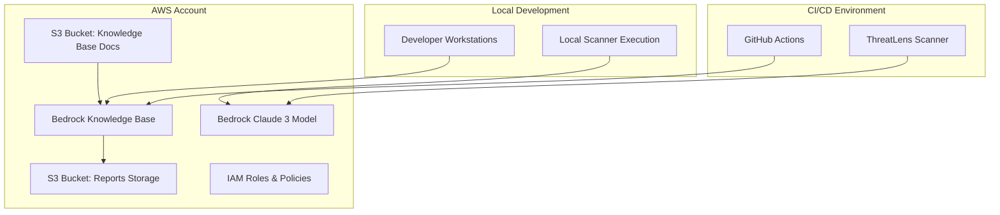

# ThreatLens Scanner Deployment Guide

## Overview

This guide covers enterprise deployment of ThreatLens Scanner across development, staging, and production environments with AWS infrastructure setup.

## Prerequisites

### **AWS Account Requirements**
- AWS Account with Bedrock access enabled
- IAM permissions for Bedrock, S3, and Knowledge Base
- AWS CLI configured with appropriate credentials
- Python 3.11+ environment

### **Service Limits**
- Bedrock Claude 3 Haiku access in target region
- S3 bucket creation permissions
- Knowledge Base creation limits (default: 10 per account)

## Architecture Deployment

### **Infrastructure Components**


## Step-by-Step Deployment

### **1. AWS Infrastructure Setup**

#### Create S3 Buckets
```bash
# Knowledge Base documents bucket
aws s3 mb s3://threatlens-kb-docs-${RANDOM} --region us-east-1

# Reports storage bucket
aws s3 mb s3://threatlens-reports-${RANDOM} --region us-east-1

# Enable versioning
aws s3api put-bucket-versioning \
  --bucket threatlens-kb-docs-${RANDOM} \
  --versioning-configuration Status=Enabled

# Configure website hosting for reports
aws s3 website s3://threatlens-reports-${RANDOM} \
  --index-document index.html \
  --error-document error.html
```

#### Create IAM Role for Bedrock
```bash
# Create trust policy
cat > bedrock-trust-policy.json << EOF
{
  "Version": "2012-10-17",
  "Statement": [
    {
      "Effect": "Allow",
      "Principal": {
        "Service": "bedrock.amazonaws.com"
      },
      "Action": "sts:AssumeRole"
    }
  ]
}
EOF

# Create IAM role
aws iam create-role \
  --role-name ThreatLensBedrockRole \
  --assume-role-policy-document file://bedrock-trust-policy.json

# Attach policies
aws iam attach-role-policy \
  --role-name ThreatLensBedrockRole \
  --policy-arn arn:aws:iam::aws:policy/AmazonBedrockFullAccess

aws iam attach-role-policy \
  --role-name ThreatLensBedrockRole \
  --policy-arn arn:aws:iam::aws:policy/AmazonS3ReadOnlyAccess
```

#### Create Knowledge Base
```bash
# Create knowledge base
aws bedrock-agent create-knowledge-base \
  --name "ThreatLens-Security-KB" \
  --description "Security compliance knowledge base for ThreatLens Scanner" \
  --role-arn "arn:aws:iam::$(aws sts get-caller-identity --query Account --output text):role/ThreatLensBedrockRole" \
  --knowledge-base-configuration '{
    "type": "VECTOR",
    "vectorKnowledgeBaseConfiguration": {
      "embeddingModelArn": "arn:aws:bedrock:us-east-1::foundation-model/amazon.titan-embed-text-v1"
    }
  }' \
  --storage-configuration '{
    "type": "OPENSEARCH_SERVERLESS",
    "opensearchServerlessConfiguration": {
      "collectionArn": "arn:aws:aoss:us-east-1:account:collection/threatlens-kb",
      "vectorIndexName": "threatlens-index",
      "fieldMapping": {
        "vectorField": "vector",
        "textField": "text",
        "metadataField": "metadata"
      }
    }
  }'
```

### **2. Knowledge Base Content Setup**

#### Upload Compliance Documents
```bash
# Clone or create compliance documents
mkdir compliance-docs
cd compliance-docs

# Create sample security rules
cat > owasp_top10.md << EOF
# OWASP Top 10 Security Rules

## A1: Injection
SQL, NoSQL, OS, and LDAP injection flaws occur when untrusted data is sent to an interpreter as part of a command or query.

### Detection Patterns
- String concatenation in SQL queries
- Use of eval() functions
- Unvalidated user input in system commands

### Remediation
- Use parameterized queries
- Input validation and sanitization
- Principle of least privilege
EOF

# Upload to S3
aws s3 sync . s3://your-kb-bucket-name/
```

#### Create Data Source
```bash
# Get knowledge base ID from previous step
KB_ID=$(aws bedrock-agent list-knowledge-bases --query 'knowledgeBaseSummaries[?name==`ThreatLens-Security-KB`].knowledgeBaseId' --output text)

# Create data source
aws bedrock-agent create-data-source \
  --knowledge-base-id $KB_ID \
  --name "S3-Compliance-Docs" \
  --description "S3 bucket containing compliance documents" \
  --data-source-configuration '{
    "type": "S3",
    "s3Configuration": {
      "bucketArn": "arn:aws:s3:::your-kb-bucket-name",
      "inclusionPrefixes": ["compliance/"]
    }
  }'

# Start ingestion
DATA_SOURCE_ID=$(aws bedrock-agent list-data-sources --knowledge-base-id $KB_ID --query 'dataSourceSummaries[0].dataSourceId' --output text)
aws bedrock-agent start-ingestion-job \
  --knowledge-base-id $KB_ID \
  --data-source-id $DATA_SOURCE_ID
```

### **3. Application Deployment**

#### Local Development Setup
```bash
# Clone repository
git clone <repository-url>
cd threatlens-scanner

# Install dependencies
pip install -r requirements.txt

# Configure environment
cat > .env << EOF
AWS_REGION=us-east-1
BEDROCK_KB_ID=${KB_ID}
BEDROCK_MODEL_ID=anthropic.claude-3-haiku-20240307-v1:0
REPORTS_S3_BUCKET=your-reports-bucket
MAX_AI_CALLS=100
MAX_COST_USD=5.0
EOF

# Test installation
python src/compliance_scanner.py --help
```

#### CI/CD Integration (GitHub Actions)
```bash
# Set repository secrets
gh secret set AWS_ACCESS_KEY_ID --body "your-access-key"
gh secret set AWS_SECRET_ACCESS_KEY --body "your-secret-key"

# Set repository variables
gh variable set AWS_REGION --body "us-east-1"
gh variable set BEDROCK_KB_ID --body "${KB_ID}"
gh variable set BEDROCK_MODEL_ID --body "anthropic.claude-3-haiku-20240307-v1:0"
gh variable set REPORTS_S3_BUCKET --body "your-reports-bucket"
```

## Multi-Environment Deployment

### **Environment Strategy**
```
Development:
- Separate KB and S3 buckets
- Lower cost limits (MAX_COST_USD=1.0)
- Relaxed compliance thresholds

Staging:
- Production-like configuration
- Full compliance rule set
- Performance testing enabled

Production:
- High availability setup
- Comprehensive monitoring
- Strict cost controls
```

### **Environment Configuration**
```bash
# Development
export BEDROCK_KB_ID=threatlens-dev-kb
export MAX_COST_USD=1.0
export MAX_AI_CALLS=50

# Staging
export BEDROCK_KB_ID=threatlens-staging-kb
export MAX_COST_USD=3.0
export MAX_AI_CALLS=75

# Production
export BEDROCK_KB_ID=threatlens-prod-kb
export MAX_COST_USD=5.0
export MAX_AI_CALLS=100
```

## Monitoring and Alerting

### **CloudWatch Metrics**
```bash
# Create custom metrics dashboard
aws cloudwatch put-dashboard \
  --dashboard-name "ThreatLens-Scanner" \
  --dashboard-body '{
    "widgets": [
      {
        "type": "metric",
        "properties": {
          "metrics": [
            ["AWS/Bedrock", "InvocationsCount", "ModelId", "anthropic.claude-3-haiku-20240307-v1:0"],
            ["AWS/Bedrock", "InvocationsLatency", "ModelId", "anthropic.claude-3-haiku-20240307-v1:0"]
          ],
          "period": 300,
          "stat": "Sum",
          "region": "us-east-1",
          "title": "Bedrock Usage"
        }
      }
    ]
  }'
```

### **Cost Alerts**
```bash
# Create billing alarm
aws cloudwatch put-metric-alarm \
  --alarm-name "ThreatLens-High-Cost" \
  --alarm-description "Alert when ThreatLens costs exceed threshold" \
  --metric-name EstimatedCharges \
  --namespace AWS/Billing \
  --statistic Maximum \
  --period 86400 \
  --threshold 50 \
  --comparison-operator GreaterThanThreshold \
  --dimensions Name=Currency,Value=USD Name=ServiceName,Value=AmazonBedrock
```

## Security Configuration

### **IAM Policies**
```json
{
  "Version": "2012-10-17",
  "Statement": [
    {
      "Effect": "Allow",
      "Action": [
        "bedrock:InvokeModel",
        "bedrock:Retrieve"
      ],
      "Resource": [
        "arn:aws:bedrock:us-east-1::foundation-model/anthropic.claude-3-haiku-20240307-v1:0",
        "arn:aws:bedrock:us-east-1:account:knowledge-base/KB_ID"
      ]
    },
    {
      "Effect": "Allow",
      "Action": [
        "s3:GetObject",
        "s3:PutObject"
      ],
      "Resource": [
        "arn:aws:s3:::reports-bucket/*"
      ]
    }
  ]
}
```

### **S3 Bucket Policies**
```json
{
  "Version": "2012-10-17",
  "Statement": [
    {
      "Effect": "Allow",
      "Principal": {
        "AWS": "arn:aws:iam::account:role/ThreatLensRole"
      },
      "Action": "s3:GetObject",
      "Resource": "arn:aws:s3:::kb-bucket/*"
    }
  ]
}
```

## Scaling Considerations

### **Performance Optimization**
- **Caching**: Implement Redis for cross-environment caching
- **Parallel Processing**: Use AWS Lambda for concurrent scans
- **Load Balancing**: API Gateway for multiple scanner instances

### **Cost Optimization**
- **Reserved Capacity**: Consider Bedrock reserved pricing for high volume
- **S3 Lifecycle**: Implement policies for report retention
- **Monitoring**: Set up automated cost optimization recommendations

## Troubleshooting

### **Common Deployment Issues**

#### Knowledge Base Creation Fails
```bash
# Check service limits
aws service-quotas get-service-quota \
  --service-code bedrock \
  --quota-code L-1234567890

# Verify IAM permissions
aws iam simulate-principal-policy \
  --policy-source-arn arn:aws:iam::account:role/ThreatLensBedrockRole \
  --action-names bedrock:CreateKnowledgeBase
```

#### Scanner Authentication Issues
```bash
# Test AWS credentials
aws sts get-caller-identity

# Test Bedrock access
aws bedrock list-foundation-models --region us-east-1
```

#### High Costs
```bash
# Check current usage
aws ce get-cost-and-usage \
  --time-period Start=2024-01-01,End=2024-01-31 \
  --granularity MONTHLY \
  --metrics BlendedCost \
  --group-by Type=DIMENSION,Key=SERVICE
```

## Maintenance

### **Regular Tasks**
- **Weekly**: Review cost reports and usage patterns
- **Monthly**: Update compliance documents in knowledge base
- **Quarterly**: Review and optimize IAM policies
- **Annually**: Evaluate service limits and scaling requirements

### **Backup Strategy**
- **Knowledge Base**: Regular S3 sync of compliance documents
- **Reports**: S3 lifecycle policies for long-term retention
- **Configuration**: Infrastructure as Code (CloudFormation/Terraform)

## Support and Documentation

### **Internal Documentation**
- Maintain deployment runbooks
- Document environment-specific configurations
- Create troubleshooting guides for common issues

### **External Resources**
- [AWS Bedrock Documentation](https://docs.aws.amazon.com/bedrock/)
- [Knowledge Base API Reference](https://docs.aws.amazon.com/bedrock/latest/APIReference/)
- [ThreatLens GitHub Repository](https://github.com/your-org/threatlens-scanner)
