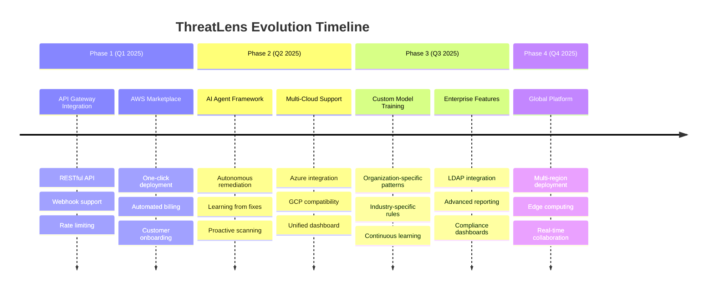

# Future State Roadmap

## Vision Statement

Transform ThreatLens Scanner from a specialized security tool into a comprehensive AI-powered security platform that autonomously protects, monitors, and optimizes application security across multi-cloud environments.

## Roadmap Overview



## Phase 1: API Gateway & Marketplace (Q1 2025)

### **API Gateway Integration**

#### **RESTful API Design**
```python
# Proposed API endpoints
API_ENDPOINTS = {
    'POST /v1/scan': {
        'description': 'Initiate security scan',
        'payload': {
            'repository_url': 'https://github.com/org/repo',
            'branch': 'main',
            'scan_options': {
                'auto_fix': True,
                'compliance_standards': ['OWASP', 'PCI-DSS'],
                'severity_threshold': 'medium'
            }
        },
        'response': {
            'scan_id': 'uuid',
            'status': 'initiated',
            'estimated_completion': '2024-01-01T10:30:00Z'
        }
    },
    
    'GET /v1/scan/{scan_id}': {
        'description': 'Get scan results',
        'response': {
            'scan_id': 'uuid',
            'status': 'completed',
            'results': {
                'total_issues': 25,
                'critical': 3,
                'high': 8,
                'medium': 14,
                'fixed_automatically': 5
            }
        }
    },
    
    'POST /v1/webhook': {
        'description': 'Webhook for CI/CD integration',
        'payload': {
            'event_type': 'push',
            'repository': 'org/repo',
            'commit_sha': 'abc123',
            'auto_scan': True
        }
    }
}
```

#### **Authentication & Authorization**
```python
class APIAuthentication:
    """API key and JWT-based authentication"""
    
    def __init__(self):
        self.api_key_manager = APIKeyManager()
        self.jwt_handler = JWTHandler()
        self.rate_limiter = RateLimiter()
    
    def authenticate_request(self, request):
        """Multi-tier authentication"""
        # 1. API key validation
        api_key = request.headers.get('X-API-Key')
        if not self.api_key_manager.validate_key(api_key):
            raise UnauthorizedError("Invalid API key")
        
        # 2. Rate limiting
        if not self.rate_limiter.allow_request(api_key):
            raise RateLimitExceededError("Rate limit exceeded")
        
        # 3. JWT token validation (for user sessions)
        jwt_token = request.headers.get('Authorization')
        if jwt_token:
            user_context = self.jwt_handler.decode_token(jwt_token)
            return user_context
        
        return {'api_key': api_key, 'tier': 'basic'}
```

### **AWS Marketplace Integration**

#### **One-Click Deployment**
```yaml
# CloudFormation template for Marketplace
AWSTemplateFormatVersion: '2010-09-09'
Description: 'ThreatLens Scanner - One-Click Security Solution'

Parameters:
  OrganizationName:
    Type: String
    Description: Your organization name
  
  ComplianceStandards:
    Type: CommaDelimitedList
    Default: "OWASP,PCI-DSS,NIST"
    Description: Compliance standards to enforce

Resources:
  ThreatLensStack:
    Type: AWS::CloudFormation::Stack
    Properties:
      TemplateURL: !Sub 'https://threatlens-templates.s3.amazonaws.com/main-stack.yaml'
      Parameters:
        OrgName: !Ref OrganizationName
        Standards: !Join [',', !Ref ComplianceStandards]
        
  ThreatLensAPI:
    Type: AWS::ApiGateway::RestApi
    Properties:
      Name: ThreatLens-API
      Description: ThreatLens Scanner API Gateway
      
  ThreatLensDashboard:
    Type: AWS::S3::Bucket
    Properties:
      BucketName: !Sub 'threatlens-dashboard-${AWS::AccountId}'
      WebsiteConfiguration:
        IndexDocument: index.html
```

#### **Automated Billing Integration**
```python
class MarketplaceBilling:
    """AWS Marketplace billing integration"""
    
    def __init__(self):
        self.marketplace_client = boto3.client('meteringmarketplace')
        self.usage_tracker = UsageTracker()
    
    def report_usage(self, customer_id, usage_metrics):
        """Report usage to AWS Marketplace"""
        
        usage_records = []
        for metric_name, value in usage_metrics.items():
            usage_records.append({
                'Timestamp': datetime.utcnow(),
                'CustomerIdentifier': customer_id,
                'Dimension': metric_name,  # e.g., 'scans-performed'
                'Quantity': value
            })
        
        # Submit usage to AWS Marketplace
        response = self.marketplace_client.batch_meter_usage(
            UsageRecords=usage_records,
            ProductCode='threatlens-scanner-v1'
        )
        
        return response
    
    def get_pricing_tiers(self):
        """Define pricing tiers for marketplace"""
        return {
            'starter': {
                'scans_per_month': 100,
                'price_per_scan': 0.05,
                'features': ['Basic scanning', 'GitHub integration']
            },
            'professional': {
                'scans_per_month': 1000,
                'price_per_scan': 0.03,
                'features': ['Advanced scanning', 'Auto-fix', 'API access']
            },
            'enterprise': {
                'scans_per_month': 'unlimited',
                'price_per_scan': 0.02,
                'features': ['All features', 'Custom rules', 'Priority support']
            }
        }
```

## Phase 2: AI Agent Framework & Multi-Cloud (Q2 2025)

### **AI Agent Framework**

#### **Autonomous Security Agent**
```python
class SecurityAgent:
    """Autonomous AI agent for proactive security"""
    
    def __init__(self):
        self.learning_engine = ContinuousLearningEngine()
        self.decision_engine = SecurityDecisionEngine()
        self.action_executor = AutomatedActionExecutor()
        self.knowledge_graph = SecurityKnowledgeGraph()
    
    def autonomous_security_cycle(self):
        """Continuous security improvement cycle"""
        
        while True:
            # 1. Proactive threat detection
            potential_threats = self.scan_for_emerging_threats()
            
            # 2. Risk assessment
            risk_analysis = self.assess_threat_risk(potential_threats)
            
            # 3. Autonomous decision making
            actions = self.decision_engine.recommend_actions(risk_analysis)
            
            # 4. Execute approved actions
            for action in actions:
                if action.confidence_score > 0.9:
                    self.action_executor.execute(action)
                else:
                    self.request_human_approval(action)
            
            # 5. Learn from outcomes
            self.learning_engine.update_from_results(actions)
            
            # Wait before next cycle
            time.sleep(3600)  # 1 hour
    
    def learn_from_fix_outcomes(self, fix_attempts):
        """Learn from successful and failed fixes"""
        
        for fix in fix_attempts:
            if fix.was_successful:
                # Reinforce successful patterns
                self.learning_engine.reinforce_pattern(
                    vulnerability_type=fix.vulnerability_type,
                    fix_pattern=fix.applied_fix,
                    success_score=fix.success_metrics
                )
            else:
                # Learn from failures
                self.learning_engine.avoid_pattern(
                    vulnerability_type=fix.vulnerability_type,
                    failed_fix=fix.attempted_fix,
                    failure_reason=fix.failure_reason
                )
```

#### **Proactive Scanning Intelligence**
```python
class ProactiveScanner:
    """AI-driven proactive security scanning"""
    
    def __init__(self):
        self.threat_intelligence = ThreatIntelligenceFeed()
        self.pattern_predictor = VulnerabilityPatternPredictor()
        self.risk_calculator = DynamicRiskCalculator()
    
    def predict_vulnerability_hotspots(self, codebase):
        """Predict where vulnerabilities are likely to emerge"""
        
        # Analyze code patterns
        code_patterns = self.extract_patterns(codebase)
        
        # Correlate with threat intelligence
        threat_correlations = self.threat_intelligence.correlate_patterns(code_patterns)
        
        # Predict high-risk areas
        risk_predictions = self.pattern_predictor.predict_risks(
            patterns=code_patterns,
            threat_intel=threat_correlations,
            historical_data=self.get_historical_vulnerabilities()
        )
        
        return sorted(risk_predictions, key=lambda x: x.risk_score, reverse=True)
    
    def adaptive_scanning_schedule(self, repository):
        """Dynamically adjust scanning frequency based on risk"""
        
        risk_factors = {
            'recent_commits': len(repository.get_recent_commits(days=7)),
            'external_dependencies': len(repository.get_dependencies()),
            'security_history': repository.get_vulnerability_history(),
            'team_size': len(repository.get_contributors()),
            'deployment_frequency': repository.get_deployment_frequency()
        }
        
        # Calculate dynamic scan frequency
        base_frequency = 24  # hours
        risk_multiplier = self.risk_calculator.calculate_multiplier(risk_factors)
        
        optimal_frequency = base_frequency / risk_multiplier
        
        return {
            'scan_frequency_hours': optimal_frequency,
            'priority_level': self.calculate_priority(risk_multiplier),
            'recommended_actions': self.get_risk_mitigation_actions(risk_factors)
        }
```

### **Multi-Cloud Support**

#### **Azure Integration**
```python
class AzureSecurityIntegration:
    """Azure cloud security integration"""
    
    def __init__(self):
        self.azure_client = AzureSecurityCenter()
        self.cognitive_services = AzureCognitiveServices()
        self.key_vault = AzureKeyVault()
    
    def scan_azure_resources(self, subscription_id):
        """Scan Azure resources for security issues"""
        
        # Get Azure resources
        resources = self.azure_client.get_resources(subscription_id)
        
        # Analyze configurations
        security_issues = []
        for resource in resources:
            issues = self.analyze_azure_resource(resource)
            security_issues.extend(issues)
        
        # Integrate with ThreatLens analysis
        threatlens_analysis = self.integrate_with_threatlens(security_issues)
        
        return {
            'azure_issues': security_issues,
            'threatlens_analysis': threatlens_analysis,
            'unified_report': self.create_unified_report(security_issues, threatlens_analysis)
        }
    
    def azure_ai_integration(self, code_content):
        """Integrate with Azure AI services"""
        
        # Use Azure OpenAI as alternative to Bedrock
        azure_analysis = self.cognitive_services.analyze_code(
            content=code_content,
            model='gpt-4',
            temperature=0
        )
        
        # Combine with ThreatLens knowledge base
        kb_context = self.get_threatlens_kb_context(code_content)
        
        return self.merge_analysis_results(azure_analysis, kb_context)
```

#### **GCP Integration**
```python
class GCPSecurityIntegration:
    """Google Cloud Platform security integration"""
    
    def __init__(self):
        self.security_center = GCPSecurityCommandCenter()
        self.vertex_ai = VertexAI()
        self.cloud_functions = CloudFunctions()
    
    def deploy_threatlens_on_gcp(self):
        """Deploy ThreatLens scanner on GCP"""
        
        deployment_config = {
            'cloud_function': {
                'name': 'threatlens-scanner',
                'runtime': 'python311',
                'memory': '2GB',
                'timeout': '540s',
                'environment_variables': {
                    'BEDROCK_ENDPOINT': 'cross-cloud-proxy',
                    'KB_ENDPOINT': 'unified-kb-service'
                }
            },
            'vertex_ai_integration': {
                'model': 'text-bison',
                'fallback_to_bedrock': True
            }
        }
        
        return self.cloud_functions.deploy(deployment_config)
```

## Phase 3: Custom Model Training & Enterprise Features (Q3 2025)

### **Custom Model Training**

#### **Organization-Specific Pattern Learning**
```python
class CustomModelTrainer:
    """Train custom models for organization-specific patterns"""
    
    def __init__(self):
        self.model_trainer = BedrockCustomModelTrainer()
        self.pattern_extractor = OrganizationPatternExtractor()
        self.validation_engine = ModelValidationEngine()
    
    def train_organization_model(self, organization_data):
        """Train custom model for specific organization"""
        
        # Extract organization-specific patterns
        patterns = self.pattern_extractor.extract_patterns(
            codebase=organization_data.codebase,
            vulnerability_history=organization_data.vulnerability_history,
            coding_standards=organization_data.coding_standards,
            compliance_requirements=organization_data.compliance_requirements
        )
        
        # Prepare training data
        training_data = self.prepare_training_data(patterns)
        
        # Train custom model
        custom_model = self.model_trainer.train_model(
            base_model='anthropic.claude-3-haiku-20240307-v1:0',
            training_data=training_data,
            organization_id=organization_data.org_id
        )
        
        # Validate model performance
        validation_results = self.validation_engine.validate_model(
            model=custom_model,
            test_data=organization_data.test_cases
        )
        
        if validation_results.accuracy > 0.95:
            return self.deploy_custom_model(custom_model, organization_data.org_id)
        else:
            return self.retrain_with_feedback(custom_model, validation_results)
    
    def continuous_model_improvement(self, org_id):
        """Continuously improve model based on usage"""
        
        # Collect feedback from scans
        scan_feedback = self.collect_scan_feedback(org_id)
        
        # Identify improvement opportunities
        improvement_areas = self.analyze_feedback(scan_feedback)
        
        # Retrain model with new data
        if len(improvement_areas) > 10:  # Threshold for retraining
            self.retrain_model(org_id, improvement_areas)
```

#### **Industry-Specific Rule Sets**
```python
class IndustrySpecificRules:
    """Industry-specific compliance and security rules"""
    
    def __init__(self):
        self.industry_rules = {
            'healthcare': HealthcareSecurityRules(),
            'finance': FinancialSecurityRules(),
            'government': GovernmentSecurityRules(),
            'retail': RetailSecurityRules()
        }
    
    def get_industry_rules(self, industry_type):
        """Get industry-specific security rules"""
        
        base_rules = self.get_base_security_rules()
        industry_rules = self.industry_rules.get(industry_type, {})
        
        return {
            'compliance_standards': industry_rules.get_compliance_standards(),
            'security_patterns': industry_rules.get_security_patterns(),
            'risk_thresholds': industry_rules.get_risk_thresholds(),
            'remediation_priorities': industry_rules.get_remediation_priorities()
        }

class HealthcareSecurityRules:
    """HIPAA and healthcare-specific security rules"""
    
    def get_compliance_standards(self):
        return [
            'HIPAA Security Rule',
            'HIPAA Privacy Rule',
            'HITECH Act',
            'FDA 21 CFR Part 11'
        ]
    
    def get_security_patterns(self):
        return {
            'phi_detection': {
                'patterns': [
                    r'\b\d{3}-\d{2}-\d{4}\b',  # SSN
                    r'\b\d{10}\b',  # Medical record numbers
                    r'patient.*(?:name|id|ssn)',  # Patient identifiers
                ],
                'severity': 'critical',
                'remediation': 'Encrypt PHI data and implement access controls'
            },
            'audit_logging': {
                'required_events': ['access', 'modification', 'deletion'],
                'retention_period': '6_years',
                'encryption_required': True
            }
        }
```

### **Enterprise Features**

#### **Advanced Reporting & Dashboards**
```python
class EnterpriseReporting:
    """Enterprise-grade reporting and analytics"""
    
    def __init__(self):
        self.report_generator = AdvancedReportGenerator()
        self.analytics_engine = SecurityAnalyticsEngine()
        self.dashboard_builder = DashboardBuilder()
    
    def generate_executive_dashboard(self, organization_id):
        """Generate executive-level security dashboard"""
        
        # Collect organization metrics
        metrics = self.analytics_engine.get_organization_metrics(organization_id)
        
        # Generate executive summary
        executive_summary = {
            'security_posture_score': metrics.calculate_security_score(),
            'risk_trend': metrics.get_risk_trend(days=90),
            'compliance_status': metrics.get_compliance_status(),
            'cost_optimization': metrics.get_cost_savings(),
            'team_productivity': metrics.get_productivity_metrics()
        }
        
        # Create interactive dashboard
        dashboard = self.dashboard_builder.create_dashboard(
            template='executive',
            data=executive_summary,
            customizations=self.get_org_customizations(organization_id)
        )
        
        return dashboard
    
    def generate_compliance_report(self, standards, time_period):
        """Generate detailed compliance reports"""
        
        compliance_data = {}
        for standard in standards:
            compliance_data[standard] = {
                'current_status': self.get_compliance_status(standard),
                'violations': self.get_violations(standard, time_period),
                'remediation_progress': self.get_remediation_progress(standard),
                'risk_assessment': self.assess_compliance_risk(standard)
            }
        
        return self.report_generator.create_compliance_report(compliance_data)
```

## Phase 4: Global Platform & Edge Computing (Q4 2025)

### **Multi-Region Deployment**

#### **Global Load Balancing**
```python
class GlobalDeploymentManager:
    """Manage global deployment across regions"""
    
    def __init__(self):
        self.regions = ['us-east-1', 'eu-west-1', 'ap-southeast-1', 'us-west-2']
        self.load_balancer = GlobalLoadBalancer()
        self.data_replication = DataReplicationManager()
    
    def deploy_global_infrastructure(self):
        """Deploy ThreatLens across multiple regions"""
        
        deployment_plan = {
            'primary_region': 'us-east-1',
            'secondary_regions': ['eu-west-1', 'ap-southeast-1'],
            'disaster_recovery': 'us-west-2',
            'data_residency_compliance': True
        }
        
        for region in self.regions:
            self.deploy_regional_stack(region, deployment_plan)
        
        # Configure global load balancing
        self.load_balancer.configure_global_routing(
            health_checks=True,
            latency_based_routing=True,
            failover_enabled=True
        )
        
        return deployment_plan
    
    def edge_computing_integration(self):
        """Deploy edge computing nodes for reduced latency"""
        
        edge_locations = [
            'CloudFront Edge Locations',
            'AWS Wavelength Zones',
            'AWS Local Zones'
        ]
        
        for location in edge_locations:
            self.deploy_edge_scanner(location)
```

### **Real-time Collaboration Platform**

#### **Collaborative Security Platform**
```python
class CollaborativeSecurityPlatform:
    """Real-time collaboration for security teams"""
    
    def __init__(self):
        self.websocket_manager = WebSocketManager()
        self.collaboration_engine = CollaborationEngine()
        self.notification_system = RealTimeNotifications()
    
    def enable_real_time_collaboration(self):
        """Enable real-time collaboration features"""
        
        features = {
            'live_scan_sharing': {
                'description': 'Share scan results in real-time',
                'implementation': self.setup_live_scan_sharing
            },
            'collaborative_remediation': {
                'description': 'Multiple team members can work on fixes',
                'implementation': self.setup_collaborative_fixes
            },
            'security_chat': {
                'description': 'Integrated chat for security discussions',
                'implementation': self.setup_security_chat
            },
            'knowledge_sharing': {
                'description': 'Share security knowledge across teams',
                'implementation': self.setup_knowledge_sharing
            }
        }
        
        for feature_name, feature_config in features.items():
            feature_config['implementation']()
        
        return features
```

## Investment & Resource Requirements

### **Development Investment**
```python
DEVELOPMENT_INVESTMENT = {
    'Phase 1 (Q1 2025)': {
        'engineering_team': 8,  # developers
        'duration_months': 3,
        'estimated_cost': 480000,  # $60k/month per developer
        'key_deliverables': ['API Gateway', 'AWS Marketplace']
    },
    
    'Phase 2 (Q2 2025)': {
        'engineering_team': 12,
        'duration_months': 3,
        'estimated_cost': 720000,
        'key_deliverables': ['AI Agent Framework', 'Multi-Cloud']
    },
    
    'Phase 3 (Q3 2025)': {
        'engineering_team': 15,
        'duration_months': 3,
        'estimated_cost': 900000,
        'key_deliverables': ['Custom Models', 'Enterprise Features']
    },
    
    'Phase 4 (Q4 2025)': {
        'engineering_team': 20,
        'duration_months': 3,
        'estimated_cost': 1200000,
        'key_deliverables': ['Global Platform', 'Edge Computing']
    }
}

TOTAL_INVESTMENT = sum(phase['estimated_cost'] for phase in DEVELOPMENT_INVESTMENT.values())
# Total: $3.3M over 12 months
```

### **Revenue Projections**
```python
REVENUE_PROJECTIONS = {
    'Year 1 (2025)': {
        'marketplace_customers': 500,
        'avg_monthly_revenue_per_customer': 200,
        'annual_revenue': 1200000,  # $1.2M
        'growth_rate': '100% (new product)'
    },
    
    'Year 2 (2026)': {
        'marketplace_customers': 2000,
        'avg_monthly_revenue_per_customer': 300,
        'annual_revenue': 7200000,  # $7.2M
        'growth_rate': '500%'
    },
    
    'Year 3 (2027)': {
        'marketplace_customers': 5000,
        'avg_monthly_revenue_per_customer': 400,
        'annual_revenue': 24000000,  # $24M
        'growth_rate': '233%'
    }
}

# ROI Calculation
# Investment: $3.3M
# 3-Year Revenue: $32.4M
# ROI: 882%
```

## Success Metrics & KPIs

### **Technical Metrics**
- **Scan Performance**: <1 second per file
- **Accuracy**: >98% vulnerability detection
- **False Positive Rate**: <2%
- **Uptime**: 99.99% availability
- **Global Latency**: <200ms worldwide

### **Business Metrics**
- **Customer Acquisition**: 500 customers by end of 2025
- **Revenue Growth**: $1.2M ARR by end of 2025
- **Market Share**: 5% of security scanning market
- **Customer Satisfaction**: >4.8/5.0 rating
- **Cost Efficiency**: 95% cost advantage over competitors

### **Innovation Metrics**
- **AI Model Accuracy**: Continuous improvement >2% quarterly
- **Custom Model Adoption**: 50% of enterprise customers
- **API Usage**: 1M+ API calls per month
- **Partner Integrations**: 20+ tool integrations

## Risk Mitigation

### **Technical Risks**
- **AI Model Limitations**: Maintain fallback to rule-based detection
- **Cloud Vendor Lock-in**: Multi-cloud architecture from Phase 2
- **Scalability Challenges**: Microservices architecture with auto-scaling
- **Security Vulnerabilities**: Regular security audits and penetration testing

### **Business Risks**
- **Market Competition**: Focus on unique AI capabilities and cost advantage
- **Customer Adoption**: Comprehensive onboarding and support programs
- **Regulatory Changes**: Proactive compliance monitoring and adaptation
- **Technology Obsolescence**: Continuous innovation and R&D investment

This roadmap positions ThreatLens Scanner to become the leading AI-powered security platform, combining cutting-edge technology with practical business value for organizations worldwide.
