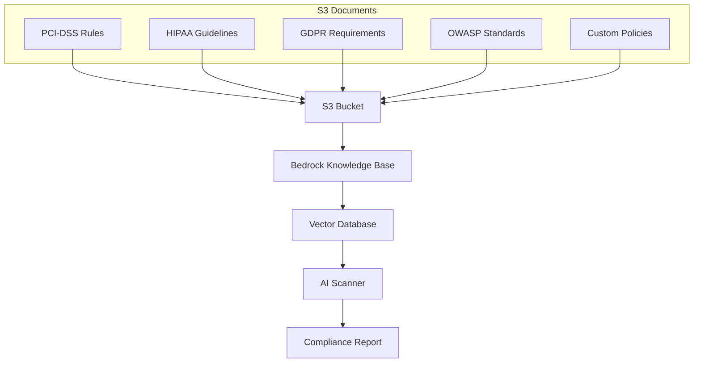

# 📚 Knowledge Base Setup Guide

## Overview

The Knowledge Base is the intelligence layer of the AI Security Scanner, providing real-time rule lookup and document traceability. This guide covers setup, configuration, and best practices.

## Architecture



## Prerequisites

- AWS Account with Bedrock access
- S3 bucket for document storage
- IAM roles with appropriate permissions
- Compliance documents in supported formats

## Step 1: S3 Bucket Setup

### Create S3 Bucket
```bash
# Create bucket for Knowledge Base documents
aws s3 mb s3://ai-security-kb-docs-2025 --region us-east-1

# Enable versioning
aws s3api put-bucket-versioning \
  --bucket ai-security-kb-docs-2025 \
  --versioning-configuration Status=Enabled

# Enable encryption
aws s3api put-bucket-encryption \
  --bucket ai-security-kb-docs-2025 \
  --server-side-encryption-configuration '{
    "Rules": [{
      "ApplyServerSideEncryptionByDefault": {
        "SSEAlgorithm": "AES256"
      }
    }]
  }'
```

### Upload Compliance Documents
```bash
# Create document structure
mkdir -p compliance-docs/{general,terraform,kubernetes,javascript,python}

# Upload documents
aws s3 sync compliance-docs/ s3://ai-security-kb-docs-2025/ --delete
```

## Step 2: Document Structure

### Recommended Directory Structure
```
s3://ai-security-kb-docs-2025/
├── general_security.md          # Cross-language security rules
├── terraform_security.md        # Terraform-specific rules
├── kubernetes_security.md       # Kubernetes security policies
├── javascript_security.md       # JavaScript/Node.js rules
├── python_security.md          # Python-specific rules
├── compliance/
│   ├── pci-dss-requirements.md  # PCI-DSS compliance rules
│   ├── hipaa-security-rule.md   # HIPAA security requirements
│   ├── gdpr-technical-measures.md # GDPR technical safeguards
│   └── owasp-top10.md          # OWASP Top 10 guidelines
└── custom/
    ├── company-policies.md      # Organization-specific rules
    └── industry-standards.md    # Industry-specific requirements
```

### Document Format Standards

#### 1. General Security Rules (`general_security.md`)
```markdown
# General Security Rules

## Authentication and Authorization

### Rule: Strong Password Requirements
**Compliance**: PCI-DSS 8.2, HIPAA §164.308(a)(5)(ii)(D)
**Severity**: HIGH

Passwords must meet complexity requirements:
- Minimum 12 characters
- Mix of uppercase, lowercase, numbers, symbols
- No dictionary words or personal information

**Code Examples**:
```python
# Violation
password = "password123"

# Compliant
password = generate_secure_password(min_length=12, complexity=True)
```

### Rule: Multi-Factor Authentication
**Compliance**: PCI-DSS 8.3, SOC2 CC6.1
**Severity**: CRITICAL

All administrative access must use MFA.

**Code Examples**:
```python
# Violation
if username == "admin" and password == stored_password:
    grant_access()

# Compliant  
if username == "admin" and password == stored_password and verify_mfa(mfa_token):
    grant_access()
```
```

#### 2. Language-Specific Rules (`terraform_security.md`)
```markdown
# Terraform Security Rules

## S3 Bucket Security

### Rule: S3 Bucket Encryption
**Compliance**: PCI-DSS 3.4, HIPAA §164.312(a)(2)(iv), GDPR Article 32
**Severity**: CRITICAL

All S3 buckets must have encryption enabled.

**Terraform Example**:
```hcl
# Violation
resource "aws_s3_bucket" "example" {
  bucket = "my-bucket"
}

# Compliant
resource "aws_s3_bucket" "example" {
  bucket = "my-bucket"
}

resource "aws_s3_bucket_server_side_encryption_configuration" "example" {
  bucket = aws_s3_bucket.example.id

  rule {
    apply_server_side_encryption_by_default {
      sse_algorithm = "AES256"
    }
  }
}
```

### Rule: S3 Public Access Block
**Compliance**: PCI-DSS 1.2.1, HIPAA §164.308(a)(4)
**Severity**: CRITICAL

S3 buckets must block public access unless explicitly required.

**Terraform Example**:
```hcl
# Violation
resource "aws_s3_bucket" "example" {
  bucket = "my-bucket"
  # No public access block
}

# Compliant
resource "aws_s3_bucket_public_access_block" "example" {
  bucket = aws_s3_bucket.example.id

  block_public_acls       = true
  block_public_policy     = true
  ignore_public_acls      = true
  restrict_public_buckets = true
}
```
```

#### 3. Compliance-Specific Rules (`compliance/pci-dss-requirements.md`)
```markdown
# PCI-DSS Compliance Requirements

## Requirement 3: Protect Stored Cardholder Data

### 3.2 Do not store sensitive authentication data after authorization
**Severity**: CRITICAL
**Applies to**: All languages

Never store:
- Full track data
- Card verification codes (CVV/CVC)
- PIN verification values

**Code Patterns to Detect**:
```python
# Violations
card_data = {
    'number': '4111111111111111',
    'cvv': '123',  # Never store CVV
    'track_data': 'full_track'  # Never store track data
}

# Compliant
card_data = {
    'masked_number': '411111******1111',
    'token': 'secure_token_12345'
}
```

### 3.4 Render Primary Account Numbers (PAN) unreadable
**Severity**: CRITICAL
**Applies to**: All languages

PAN must be encrypted, truncated, masked, or hashed.

**Code Patterns**:
```javascript
// Violation
console.log(`Processing card: ${cardNumber}`);

// Compliant
console.log(`Processing card: ${maskCardNumber(cardNumber)}`);
```
```

## Step 3: IAM Role Configuration

### Create Knowledge Base Execution Role
```bash
# Create trust policy
cat > kb-trust-policy.json << EOF
{
  "Version": "2012-10-17",
  "Statement": [
    {
      "Effect": "Allow",
      "Principal": {
        "Service": "bedrock.amazonaws.com"
      },
      "Action": "sts:AssumeRole",
      "Condition": {
        "StringEquals": {
          "aws:SourceAccount": "$(aws sts get-caller-identity --query Account --output text)"
        }
      }
    }
  ]
}
EOF

# Create IAM role
aws iam create-role \
  --role-name BedrockKnowledgeBaseRole \
  --assume-role-policy-document file://kb-trust-policy.json
```

### Create IAM Policies
```bash
# S3 access policy
cat > kb-s3-policy.json << EOF
{
  "Version": "2012-10-17",
  "Statement": [
    {
      "Effect": "Allow",
      "Action": [
        "s3:GetObject",
        "s3:ListBucket"
      ],
      "Resource": [
        "arn:aws:s3:::ai-security-kb-docs-2025",
        "arn:aws:s3:::ai-security-kb-docs-2025/*"
      ]
    }
  ]
}
EOF

# Bedrock model access policy
cat > kb-bedrock-policy.json << EOF
{
  "Version": "2012-10-17",
  "Statement": [
    {
      "Effect": "Allow",
      "Action": [
        "bedrock:InvokeModel"
      ],
      "Resource": [
        "arn:aws:bedrock:us-east-1::foundation-model/amazon.titan-embed-text-v2:0",
        "arn:aws:bedrock:us-east-1::foundation-model/anthropic.claude-3-haiku-20240307-v1:0"
      ]
    }
  ]
}
EOF

# Create and attach policies
aws iam create-policy \
  --policy-name BedrockKnowledgeBaseS3Policy \
  --policy-document file://kb-s3-policy.json

aws iam create-policy \
  --policy-name BedrockKnowledgeBaseModelPolicy \
  --policy-document file://kb-bedrock-policy.json

aws iam attach-role-policy \
  --role-name BedrockKnowledgeBaseRole \
  --policy-arn arn:aws:iam::$(aws sts get-caller-identity --query Account --output text):policy/BedrockKnowledgeBaseS3Policy

aws iam attach-role-policy \
  --role-name BedrockKnowledgeBaseRole \
  --policy-arn arn:aws:iam::$(aws sts get-caller-identity --query Account --output text):policy/BedrockKnowledgeBaseModelPolicy
```

## Step 4: OpenSearch Serverless Setup

### Create OpenSearch Collection
```bash
# Create collection policy
cat > collection-policy.json << EOF
{
  "Rules": [
    {
      "ResourceType": "collection",
      "Resource": ["collection/security-kb-collection"],
      "Permission": [
        "aoss:CreateCollectionItems",
        "aoss:DeleteCollectionItems", 
        "aoss:UpdateCollectionItems",
        "aoss:DescribeCollectionItems"
      ]
    },
    {
      "ResourceType": "index",
      "Resource": ["index/security-kb-collection/*"],
      "Permission": [
        "aoss:CreateIndex",
        "aoss:DeleteIndex",
        "aoss:UpdateIndex",
        "aoss:DescribeIndex",
        "aoss:ReadDocument",
        "aoss:WriteDocument"
      ]
    }
  ],
  "Principal": [
    "arn:aws:iam::$(aws sts get-caller-identity --query Account --output text):role/BedrockKnowledgeBaseRole"
  ]
}
EOF

# Create data access policy
aws opensearchserverless create-access-policy \
  --name security-kb-access-policy \
  --type data \
  --policy file://collection-policy.json

# Create network policy (public access)
cat > network-policy.json << EOF
[
  {
    "Rules": [
      {
        "ResourceType": "collection",
        "Resource": ["collection/security-kb-collection"]
      }
    ],
    "AllowFromPublic": true
  }
]
EOF

aws opensearchserverless create-security-policy \
  --name security-kb-network-policy \
  --type network \
  --policy file://network-policy.json

# Create encryption policy
cat > encryption-policy.json << EOF
{
  "Rules": [
    {
      "ResourceType": "collection",
      "Resource": ["collection/security-kb-collection"]
    }
  ],
  "AWSOwnedKey": true
}
EOF

aws opensearchserverless create-security-policy \
  --name security-kb-encryption-policy \
  --type encryption \
  --policy file://encryption-policy.json

# Create collection
aws opensearchserverless create-collection \
  --name security-kb-collection \
  --type VECTORSEARCH \
  --description "Knowledge Base for AI Security Scanner"
```

## Step 5: Knowledge Base Creation

### Create Knowledge Base
```bash
# Get collection ARN
COLLECTION_ARN=$(aws opensearchserverless list-collections \
  --collection-filters name=security-kb-collection \
  --query 'collectionSummaries[0].arn' --output text)

# Get role ARN
ROLE_ARN=$(aws iam get-role --role-name BedrockKnowledgeBaseRole \
  --query 'Role.Arn' --output text)

# Create Knowledge Base
aws bedrock-agent create-knowledge-base \
  --name "AI Security Scanner KB" \
  --description "Knowledge Base for compliance and security rules" \
  --role-arn "$ROLE_ARN" \
  --knowledge-base-configuration '{
    "type": "VECTOR",
    "vectorKnowledgeBaseConfiguration": {
      "embeddingModelArn": "arn:aws:bedrock:us-east-1::foundation-model/amazon.titan-embed-text-v2:0",
      "embeddingModelConfiguration": {
        "bedrockEmbeddingModelConfiguration": {
          "dimensions": 1024
        }
      }
    }
  }' \
  --storage-configuration "{
    \"type\": \"OPENSEARCH_SERVERLESS\",
    \"opensearchServerlessConfiguration\": {
      \"collectionArn\": \"$COLLECTION_ARN\",
      \"vectorIndexName\": \"security-rules-index\",
      \"fieldMapping\": {
        \"vectorField\": \"bedrock-knowledge-base-default-vector\",
        \"textField\": \"AMAZON_BEDROCK_TEXT\",
        \"metadataField\": \"AMAZON_BEDROCK_METADATA\"
      }
    }
  }"
```

### Create Data Source
```bash
# Get Knowledge Base ID from previous command output
KB_ID="your-kb-id-here"

# Create data source
aws bedrock-agent create-data-source \
  --knowledge-base-id "$KB_ID" \
  --name "Security Documents" \
  --description "S3 bucket containing security and compliance documents" \
  --data-source-configuration '{
    "type": "S3",
    "s3Configuration": {
      "bucketArn": "arn:aws:s3:::ai-security-kb-docs-2025",
      "inclusionPrefixes": [""],
      "chunkingConfiguration": {
        "chunkingStrategy": "FIXED_SIZE",
        "fixedSizeChunkingConfiguration": {
          "maxTokens": 512,
          "overlapPercentage": 20
        }
      }
    }
  }'
```

## Step 6: Data Ingestion

### Start Ingestion Job
```bash
# Get data source ID
DATA_SOURCE_ID=$(aws bedrock-agent list-data-sources \
  --knowledge-base-id "$KB_ID" \
  --query 'dataSourceSummaries[0].dataSourceId' --output text)

# Start ingestion
aws bedrock-agent start-ingestion-job \
  --knowledge-base-id "$KB_ID" \
  --data-source-id "$DATA_SOURCE_ID"

# Monitor ingestion status
aws bedrock-agent get-ingestion-job \
  --knowledge-base-id "$KB_ID" \
  --data-source-id "$DATA_SOURCE_ID" \
  --ingestion-job-id "job-id-from-start-command"
```

### Verify Ingestion
```bash
# Test Knowledge Base query
aws bedrock-agent-runtime retrieve-and-generate \
  --input '{"text": "What are the PCI-DSS requirements for encryption?"}' \
  --retrieve-and-generate-configuration '{
    "type": "KNOWLEDGE_BASE",
    "knowledgeBaseConfiguration": {
      "knowledgeBaseId": "'$KB_ID'",
      "modelArn": "arn:aws:bedrock:us-east-1::foundation-model/anthropic.claude-3-haiku-20240307-v1:0"
    }
  }'
```

## Step 7: Document Management

### Adding New Documents
```bash
# Add new compliance document
aws s3 cp new-compliance-rule.md s3://ai-security-kb-docs-2025/

# Trigger re-ingestion
aws bedrock-agent start-ingestion-job \
  --knowledge-base-id "$KB_ID" \
  --data-source-id "$DATA_SOURCE_ID"
```

### Updating Existing Documents
```bash
# Update document in S3
aws s3 cp updated-document.md s3://ai-security-kb-docs-2025/existing-document.md

# Re-ingest to update Knowledge Base
aws bedrock-agent start-ingestion-job \
  --knowledge-base-id "$KB_ID" \
  --data-source-id "$DATA_SOURCE_ID"
```

### Document Versioning
```bash
# Enable S3 versioning for document history
aws s3api put-bucket-versioning \
  --bucket ai-security-kb-docs-2025 \
  --versioning-configuration Status=Enabled

# List document versions
aws s3api list-object-versions \
  --bucket ai-security-kb-docs-2025 \
  --prefix compliance/pci-dss-requirements.md
```

## Best Practices

### Document Organization
1. **Consistent Structure**: Use standardized markdown format
2. **Clear Naming**: Descriptive filenames with version numbers
3. **Logical Grouping**: Organize by compliance standard or technology
4. **Regular Updates**: Keep documents current with latest standards

### Content Guidelines
1. **Specific Examples**: Include code examples for each rule
2. **Severity Levels**: Clearly mark rule severity (CRITICAL, HIGH, MEDIUM, LOW)
3. **Compliance Mapping**: Map rules to specific compliance requirements
4. **Remediation Steps**: Provide clear fix instructions

### Performance Optimization
1. **Chunk Size**: Optimize for 512 tokens with 20% overlap
2. **Document Size**: Keep individual documents under 10MB
3. **Update Frequency**: Batch updates to minimize ingestion jobs
4. **Query Optimization**: Use specific, targeted queries

### Security Considerations
1. **Access Control**: Restrict S3 bucket access to necessary roles
2. **Encryption**: Enable S3 encryption and OpenSearch encryption
3. **Audit Logging**: Enable CloudTrail for Knowledge Base operations
4. **Network Security**: Use VPC endpoints if required

## Troubleshooting

### Common Issues

#### Ingestion Failures
```bash
# Check ingestion job status
aws bedrock-agent get-ingestion-job \
  --knowledge-base-id "$KB_ID" \
  --data-source-id "$DATA_SOURCE_ID" \
  --ingestion-job-id "$JOB_ID"

# Common causes:
# - IAM permission issues
# - Document format problems
# - S3 access denied
# - OpenSearch collection issues
```

#### Query Failures
```bash
# Test direct retrieval
aws bedrock-agent-runtime retrieve \
  --knowledge-base-id "$KB_ID" \
  --retrieval-query '{"text": "test query"}'

# Common causes:
# - Knowledge Base not ready
# - No matching documents
# - Model access denied
# - Malformed query
```

#### Performance Issues
```bash
# Monitor OpenSearch metrics
aws cloudwatch get-metric-statistics \
  --namespace AWS/AOSS \
  --metric-name SearchLatency \
  --dimensions Name=CollectionName,Value=security-kb-collection \
  --start-time 2024-01-01T00:00:00Z \
  --end-time 2024-01-02T00:00:00Z \
  --period 3600 \
  --statistics Average
```

## Monitoring and Maintenance

### CloudWatch Metrics
- Knowledge Base query latency
- Ingestion job success/failure rates
- OpenSearch collection performance
- S3 access patterns

### Regular Maintenance Tasks
1. **Monthly**: Review and update compliance documents
2. **Quarterly**: Audit Knowledge Base performance
3. **Annually**: Review IAM permissions and security policies
4. **As needed**: Re-ingest after major document updates

This Knowledge Base setup provides the foundation for intelligent, context-aware security scanning with full document traceability.
