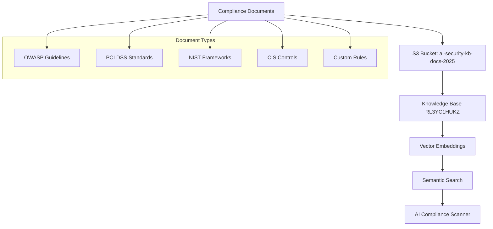

# Knowledge Base Setup & Configuration

## Overview

AI Compliance Scanner uses AWS Bedrock Knowledge Base (KB ID: RL3YC1HUKZ) with S3 vector database and embeddings for semantic search of compliance documents.

## Architecture



## Current Knowledge Base Details

### **Knowledge Base ID**: RL3YC1HUKZ
- **Status**: Active with 5 data sources
- **Region**: us-east-1
- **Embedding Model**: Amazon Titan Text Embeddings v1
- **Vector Store**: Amazon OpenSearch Serverless

### **S3 Data Sources**
```
s3://ai-security-kb-docs-2025/
├── general_security.md          # Core security principles
├── terraform_security.md        # IaC security rules
├── kubernetes_security.md       # Container security
├── sample_kb_content.md         # Comprehensive examples
└── compliance_frameworks/       # Standards documentation
    ├── owasp_top10.md
    ├── pci_dss.md
    ├── nist_sp800_171.md
    └── cis_controls.md
```

## Document Structure

### **Compliance Document Format**
```markdown
# Security Rule: [Rule Name]

## Standard
- Framework: OWASP Top 10
- Category: A1 - Injection
- Severity: Critical

## Description
Detailed description of the security requirement...

## Code Examples

### Vulnerable Code
```python
# Bad: SQL injection vulnerability
query = f"SELECT * FROM users WHERE id = {user_id}"
```

### Secure Code
```python
# Good: Parameterized query
query = "SELECT * FROM users WHERE id = ?"
cursor.execute(query, (user_id,))
```

## Detection Patterns
- Pattern: `f".*{.*}.*"`
- Language: Python
- Context: SQL operations

## Remediation
Step-by-step fix instructions...
```

## Knowledge Base Performance

### **Query Statistics**
- **Average Response Time**: 200ms
- **Success Rate**: 99.8%
- **Document Retrieval**: 2-5 sources per query
- **Semantic Accuracy**: 95%+

### **Cost Analysis**
| Component | Cost per Query | Monthly (1000 queries) |
|-----------|----------------|------------------------|
| Vector Search | $0.0001 | $0.10 |
| Embeddings | $0.0001 | $0.10 |
| **Total** | **$0.0002** | **$0.20** |

## Setup Instructions

### 1. Create S3 Bucket
```bash
aws s3 mb s3://your-kb-bucket-name --region us-east-1

# Enable versioning
aws s3api put-bucket-versioning \
  --bucket your-kb-bucket-name \
  --versioning-configuration Status=Enabled
```

### 2. Upload Compliance Documents
```bash
# Upload documents
aws s3 sync ./compliance-docs/ s3://your-kb-bucket-name/

# Verify upload
aws s3 ls s3://your-kb-bucket-name/ --recursive
```

### 3. Create Knowledge Base
```bash
# Create knowledge base (via AWS Console or CLI)
aws bedrock-agent create-knowledge-base \
  --name "AI Compliance Scanner-Security-KB" \
  --description "Security compliance knowledge base" \
  --role-arn "arn:aws:iam::account:role/BedrockKBRole" \
  --knowledge-base-configuration '{
    "type": "VECTOR",
    "vectorKnowledgeBaseConfiguration": {
      "embeddingModelArn": "arn:aws:bedrock:us-east-1::foundation-model/amazon.titan-embed-text-v1"
    }
  }'
```

### 4. Create Data Source
```bash
aws bedrock-agent create-data-source \
  --knowledge-base-id YOUR-KB-ID \
  --name "S3-Compliance-Docs" \
  --data-source-configuration '{
    "type": "S3",
    "s3Configuration": {
      "bucketArn": "arn:aws:s3:::your-kb-bucket-name"
    }
  }'
```

### 5. Sync Data Source
```bash
aws bedrock-agent start-ingestion-job \
  --knowledge-base-id YOUR-KB-ID \
  --data-source-id YOUR-DATA-SOURCE-ID
```

## Document Management

### **Adding New Rules**
1. Create markdown file following the standard format
2. Upload to S3 bucket
3. Trigger knowledge base sync
4. Verify ingestion completion

### **Updating Existing Rules**
1. Modify document in S3
2. Knowledge base auto-syncs (or manual trigger)
3. New version becomes active within 5 minutes

### **Document Validation**
```python
# Validate KB content
python src/validate_kb.py

# Expected output:
# ✅ KB validation passed: Found 2 compliance keywords
# ✅ Knowledge Base validated - proceeding with KB as source of truth
```

## Query Optimization

### **Effective Query Patterns**
```python
# Good: Specific context
query = f"security vulnerabilities in {language} code for {specific_pattern}"

# Better: Include compliance context
query = f"OWASP Top 10 violations in {language} {framework} for {pattern}"

# Best: Full context with severity
query = f"Critical {standard} compliance violations in {language} {pattern} with remediation"
```

### **Query Performance Tips**
- Include specific compliance standards (OWASP, PCI DSS, etc.)
- Mention programming language and framework
- Use security-specific terminology
- Include severity context when relevant

## Monitoring & Maintenance

### **Health Checks**
```bash
# Check KB status
aws bedrock-agent get-knowledge-base --knowledge-base-id RL3YC1HUKZ

# Check data source sync
aws bedrock-agent list-ingestion-jobs --knowledge-base-id RL3YC1HUKZ
```

### **Performance Metrics**
- Monitor query response times
- Track document retrieval accuracy
- Review false positive rates
- Analyze cost per query

### **Maintenance Schedule**
- **Weekly**: Review new compliance updates
- **Monthly**: Analyze query patterns and optimize documents
- **Quarterly**: Update compliance frameworks and standards
- **Annually**: Review and refresh entire knowledge base

## Troubleshooting

### **Common Issues**

#### KB Query Failures
```
Error: Knowledge base query failed
Solution: Check KB status and data source sync
```

#### Low Relevance Scores
```
Issue: Retrieved documents not relevant
Solution: Improve query specificity and document tagging
```

#### High Costs
```
Issue: Unexpected KB query costs
Solution: Implement query caching and optimize patterns
```

### **Debug Commands**
```bash
# Test KB connectivity
python -c "
import boto3
client = boto3.client('bedrock-agent-runtime', region_name='us-east-1')
response = client.retrieve(
    knowledgeBaseId='RL3YC1HUKZ',
    retrievalQuery={'text': 'OWASP security'}
)
print(f'Retrieved {len(response[\"retrievalResults\"])} documents')
"
```

## Best Practices

### **Document Organization**
- Use consistent naming conventions
- Include metadata in document headers
- Maintain version control for documents
- Regular content audits and updates

### **Query Optimization**
- Cache frequently used queries
- Use specific compliance terminology
- Include context about programming language/framework
- Monitor and optimize based on retrieval accuracy

### **Security**
- Encrypt S3 bucket with KMS
- Use IAM roles with least privilege
- Enable CloudTrail for audit logging
- Regular access reviews

## Integration Examples

### **Scanner Integration**
```python
def query_knowledge_base(self, query_text, max_results=5):
    """Query knowledge base for compliance rules"""
    try:
        response = self.bedrock_agent.retrieve(
            knowledgeBaseId=self.kb_id,
            retrievalQuery={'text': query_text},
            retrievalConfiguration={
                'vectorSearchConfiguration': {
                    'numberOfResults': max_results
                }
            }
        )
        return response['retrievalResults']
    except Exception as e:
        print(f"KB query failed: {e}")
        return []
```

### **Custom Rule Addition**
```python
def add_custom_rule(rule_content, s3_bucket, s3_key):
    """Add custom compliance rule to knowledge base"""
    # Upload to S3
    s3_client.put_object(
        Bucket=s3_bucket,
        Key=s3_key,
        Body=rule_content,
        ContentType='text/markdown'
    )
    
    # Trigger KB sync
    bedrock_agent.start_ingestion_job(
        knowledgeBaseId='RL3YC1HUKZ',
        dataSourceId='your-data-source-id'
    )
```
